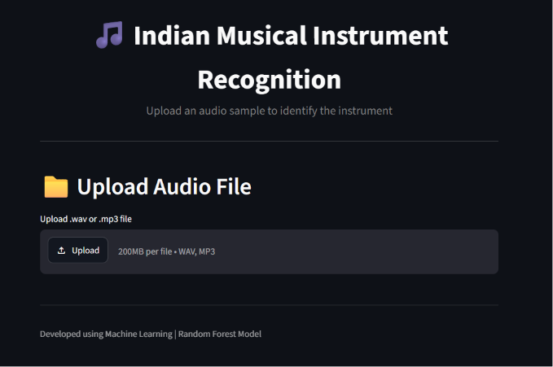
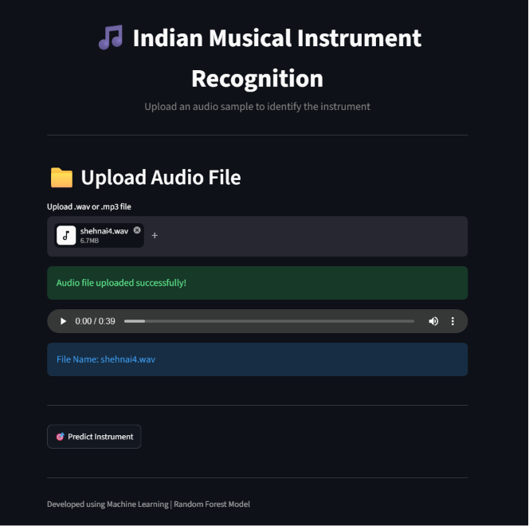
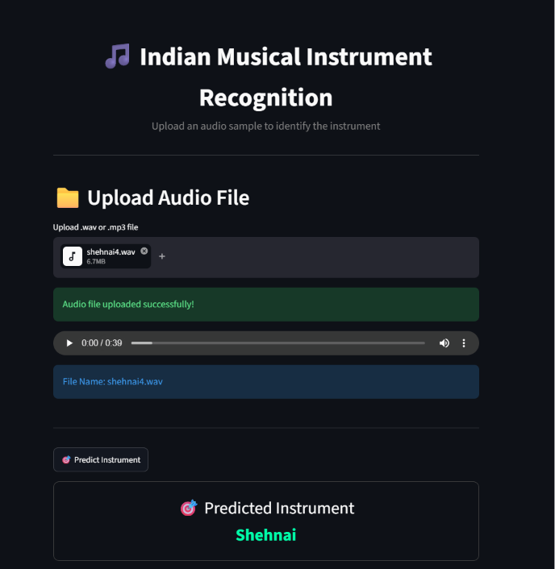
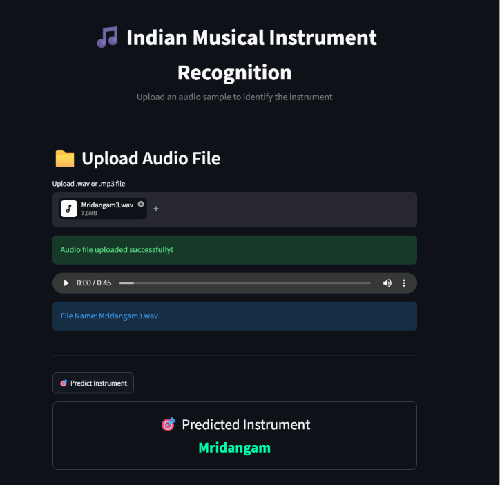

# 🎵 Indian Musical Instrument Recognition

A Machine Learning-based web application that automatically identifies Indian musical instruments from uploaded audio files using MFCC (Mel-Frequency Cepstral Coefficients) feature extraction and a Random Forest classifier.

🌐 Live Demo:
https://indian-musical-instrument-recognition-nfotnaemmnxrmt5uwdh7nu.streamlit.app/

---

## 📌 Project Overview

Indian classical music contains a rich variety of instruments with unique acoustic characteristics. Identifying these instruments manually requires musical expertise and can be time-consuming.

This project automates the recognition process by analyzing uploaded audio samples and predicting the corresponding musical instrument using Machine Learning techniques.

The system accepts audio files (.wav/.mp3), extracts MFCC features, and predicts the instrument through a trained Random Forest model.

---

## 🎯 Objectives

- Recognize Indian musical instruments automatically from audio recordings.
- Extract meaningful audio features using MFCC.
- Train a Machine Learning model for multi-class classification.
- Provide an easy-to-use web interface using Streamlit.
- Preserve and promote Indian musical heritage through AI-powered solutions.

---

## 🎼 Supported Instruments

The model can identify the following 8 Indian musical instruments:

- Flute
- Mridangam
- Nadaswaram
- Shehnai
- Santoor
- Thavil
- Veena
- Violin

---

## 🛠️ Technologies Used

### Programming Language
- Python

### Machine Learning
- Random Forest Classifier
- Scikit-Learn

### Audio Processing
- Librosa
- NumPy

### Web Framework
- Streamlit

### Visualization
- Matplotlib
- Seaborn

---

## 📂 Dataset Information

- Total Audio Samples: 240
- Instruments: 8
- Samples per Instrument: 30
- Audio Format: WAV
- Sampling Rate: 22,050 Hz
- Duration: 30–45 seconds

The dataset was collected from publicly available sources and carefully preprocessed to remove silence and unwanted noise.

---

## ⚙️ Methodology

### Step 1: Audio Collection
Audio clips of Indian musical instruments were collected and standardized.

### Step 2: Preprocessing
- Audio trimming
- Noise reduction
- Resampling
- Format conversion

### Step 3: Feature Extraction
MFCC features are extracted from each audio sample.

### Step 4: Model Training
A Random Forest classifier is trained using extracted MFCC features.

### Step 5: Prediction
Users upload an audio file through the Streamlit interface and receive the predicted instrument.

---

## 🖥️ Application Workflow

Audio Upload
↓
Audio Preprocessing
↓
MFCC Feature Extraction
↓
Random Forest Prediction
↓
Instrument Identification

---

## 📸 Application Screenshots

### Home Page



### Audio Upload



### Shehnai Prediction



### Mridangam Prediction



---

## 🚀 How to Run Locally

### Clone Repository

```bash
git clone https://github.com/yourusername/Indian-Musical-Instrument-Recognition.git
